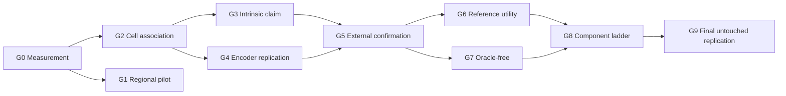

# Validation gates and authorization ladder

The machine-readable implementation is `heir.evaluation.authorization`. Gate receipts are immutable
inputs identified by SHA-256. A generic `component_pass` never grants a broader authorization.



| Gate | Required evidence | Pass authorizes |
| --- | --- | --- |
| G0 | Registration, segmentation, transcript, crop, and target-reliability QC | Running morphology experiments |
| G1 | Development-donor HESCAPE + UNI2-h against all regional controls | Exploratory engineering/regional evidence; no validation authorization |
| G2 | Five locked HEST donors, oracle fine type, donor-held-out image effect | Internal within-study go/no-go evidence to seek external confirmation |
| G3 | Prespecified mask/crop/context ladder | The precise nucleus, cell, or context conclusion supported by the pattern |
| G4 | Same estimand with H-Optimus-1 and then H0-mini | Representation-robust association |
| G5 | Non-GSE250346 registered cell-resolved cohort | External morphology–state generalization |
| G6 | Image-conditioned matched/wrong/generic bank substitution | Personalized-reference claim |
| G7 | Predicted H&E type routing and state prediction | Oracle-free H&E-only claim |
| G8 | Every retained HEIR component beats its predecessor | Claims about those retained components |
| G9 | One untouched final external replication | Full scoped HEIR validation |

Named authorizations are dependency-derived:

```text
morphology_association       = G0 and G2
nucleus_intrinsic_claim      = G0 and G2 and G3_nucleus
cell_intrinsic_claim         = G0 and G2 and (G3_nucleus or G3_cell)
external_generalization      = G0 and G2 and G5
personalized_reference_claim = G2 and G5 and G6
oracle_free_claim            = G5 and G7
full_heir_claim              = G0..G9, including the required G3 arm
```

Locked-cohort receipts move from `locked` to `opened` exactly once and record the opening commit and
timestamp. An opened cohort cannot become development evidence for the same claim.

Before H-CELL can lock, development-only H-MEAS must freeze its target/type receipt, the exact
gene-disjoint label-annotation procedure must be receipt-bound, and exact-gate synthetic calibration
must be bound to that completed scientific design and to an outcome-free ordered
donor/section/fine-type topology with per-stratum minimum support. A pre-H-MEAS, topology-pending,
or preliminary shared-latent calibration cannot authorize opening the five reserved donors.

Authorizing calibration requires six quantitative conditions: global null, G2 boundary,
nucleus-only, cell-only, context-only, and mixed intrinsic/context. Every false decision under a
global or partial null contributes to the familywise false-pass bound; each true decision contributes
only to its corresponding power bound. Inconclusive/not-tested outputs count as classification
errors rather than disappearing from the calibration denominator.

Non-smoke calibration is restricted to the dedicated CLI process. The run contract binds CPU
affinity, a one-thread default, per-trial checkpointing, a cooperative RSS ceiling, and a distinct
address-space ceiling. Existing stricter process limits are preserved. This isolation prevents a
calibration allocation failure from mutating or exhausting a notebook, service, or connection-host
process.

Authorizing evidence must also carry a hash-addressed manifest of individual actual-gate reports
from which the compiler recomputes every outcome count. Caller-supplied aggregate counts and
booleans are diagnostic only, even when internally self-consistent.

The encoder order is frozen before opening outcomes: UNI2-h is primary, H-Optimus-1 is replication
1 when accessible, and H0-mini is replication 2 when accessible. A result from the five G2 donors
is an internal falsification screen, not population-level confirmation. Section and batch one-hot
features are development-fold indicators only; they do not fully adjust unseen locked-section or
locked-batch effects.
