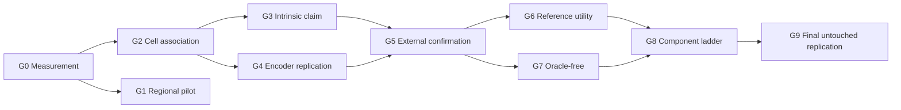

# Validation gates and authorization ladder

The machine-readable implementation is `heir.evaluation.authorization`. Gate receipts are immutable
inputs identified by SHA-256. A generic `component_pass` never grants a broader authorization.



| Gate | Required evidence | Pass authorizes |
| --- | --- | --- |
| G0 | Registration, segmentation, transcript, crop, and target-reliability QC | Running morphology experiments |
| G1 | Development-donor HESCAPE + frozen H-optimus-1 against all regional controls; UNI2-h fixed comparator | Exploratory engineering/regional evidence; no validation authorization |
| G2 | Fresh pristine registered-cell cohort, independent oracle fine type, donor-held-out image effect, and both donor/type and donor/section/type-balanced endpoints | Internal within-study go/no-go evidence to seek external confirmation |
| G3 | Prespecified mask/crop/context ladder plus registration-quality stratification | The precise nucleus, cell, or context conclusion supported by the pattern |
| G4 | Same estimand with fixed UNI2-h comparator and then H0-mini | Representation-robust association |
| G5 | Non-GSE250346 registered cell-resolved cohort | External morphology–state generalization |
| G6 | Image-conditioned matched/wrong/generic bank substitution | Personalized-reference claim |
| G7 | Predicted H&E type routing and state prediction | Oracle-free H&E-only claim |
| G8 | Every retained HEIR component beats its predecessor | Claims about those retained components |
| G9 | One untouched final external replication | Full scoped HEIR validation |

Named authorizations are dependency-derived:

```text
morphology_association       = G0 and G2
nucleus_intrinsic_claim      = G0 and G2 and G3_nucleus
cell_intrinsic_claim         = G0 and G2 and (G3_nucleus or G3_cell)
external_generalization      = G0 and G2 and G5
personalized_reference_claim = G2 and G5 and G6
oracle_free_claim            = G5 and G7
full_heir_claim              = G0..G9, including the required G3 arm
```

Locked-cohort receipts move from `locked` to `opened` exactly once and record the opening commit and
timestamp. An opened cohort cannot become development evidence for the same claim.

The historical five-donor HEST test subset is not locked under this rule. Outcomes for `THD0008`,
`THD0011`, `TILD117`, `VUILD78`, and `VUILD96` were materialized, and the test artifact was reloaded,
in `/mnt/seagate/HEIR_runs/mr_hescape_uni2h_28c6fff_1783921182` at commit `28c6fff`. No endpoint
report or metric-viewing/tuning evidence was found, so the biological hypothesis is untested, not
failed. Their prospective eligibility cannot be restored. These donors are retrospective
internal/exploratory only. G2 authorization requires a fresh pristine cohort.

Before H-CELL can lock, development-only H-MEAS must freeze its target/type receipt, the exact
gene-disjoint label-annotation procedure and the target-independent training-label ontology must be
receipt-bound, and exact-gate synthetic calibration
must be bound to that completed scientific design and to an outcome-free ordered
donor/section/fine-type topology with per-stratum minimum support. A protected annotation export
containing development sections only and independent candidate-panel-disjoint labels are required
to start H-MEAS. A pre-H-MEAS, topology-pending,
or partial truth-matrix calibration cannot authorize opening any confirmatory cohort.

H-MEAS first freezes one common reliable panel across supported fine types, with at least six genes
to support the confirmatory rank-six candidate. A fallback to prespecified programs or type-specific panels is allowed only
in a new development-only study version after primary-panel failure and before a pristine
confirmatory opening. It requires a new manifest, H-MEAS receipt, topology, and calibration; neither
historical HEST outcomes nor future confirmatory outcomes may choose it.

Authorizing calibration requires six quantitative conditions: global null, G2 boundary,
nucleus-only, cell-only, context-only, and mixed intrinsic/context. Every false decision under a
global or partial null contributes to the familywise false-pass bound; each true decision contributes
only to its corresponding power bound. Inconclusive/not-tested outputs count as classification
errors rather than disappearing from the calibration denominator.

The current literal minimum—1,000 complete trials for each of six conditions under ten stress
families—requires at least 60,000 executions of the full gate. Including its two 999-permutation null
families and repeated model selection, this is computationally infeasible as currently specified and
has not been executed. A replacement sequential simulation design must be preregistered, retain the
exact gate, use simultaneous confidence bounds, and prohibit outcome-favorable optional stopping.

Non-smoke calibration is restricted to the dedicated CLI process. The run contract binds CPU
affinity, a one-thread default, per-trial checkpointing, a cooperative RSS ceiling, and a distinct
address-space ceiling. Existing stricter process limits are preserved. This isolation prevents a
calibration allocation failure from mutating or exhausting a notebook, service, or connection-host
process.

Authorizing evidence must also carry a hash-addressed manifest of individual actual-gate reports
from which the compiler recomputes every outcome count. Caller-supplied aggregate counts and
booleans are diagnostic only, even when internally self-consistent.

The checked-in calibration implementation now structurally separates an exact six-condition
production DGP from non-authorizing smoke generation. Synthetic row-level inputs pass through the
same production locked-measurement audit and reference/evaluation balance functions, and each actual
gate report binds the full development/locked artifacts, trial identity, and run contract. The
compiler controls the per-trial union of false hypothesis decisions and reopens every content-addressed
report before accepting aggregates.
It remains non-authorizing until its complete design and topology bindings come from H-MEAS and the
required production run succeeds. No authorizing receipt exists.

G2's manifest-level joint primary endpoint explicitly binds the donor/type macro and the companion
that gives equal weight to types within section, sections within donor, and donors. Both thresholds
are 0.05 and both endpoints must pass. An observed section with no evaluable planned stratum fails
closed. The locked measurement audit reports reliability by donor/type and by
donor/section/type, including worst-section reliability and the fraction of all planned section/type
strata passing the frozen threshold.

Confirmatory registration criteria are the frozen 8-µm annotation-to-nucleus, 12-µm
annotation-to-cell, and 8-µm native cell-to-nucleus p95 limits plus the relative nucleus-diameter and
nearest-neighbor limits, each capped at 0.5 of its reference geometry. Any looser ingestion ceiling
is engineering-only and cannot authorize G0. H-MEAS and the locked H-CELL audit bind these and all
other shared segmentation, crop, and reliability fields to the identical protocol object; the
best/intermediate registration-quality fractions are exactly 0.25/0.6 and any drift fails closed.
G3 must report every contrast by best, intermediate, and near-threshold registration quality. For
nucleus/cell families and the full-context-versus-target-removed intrinsic increment used by the mixed
decision, the best-registration estimate must clear the effect threshold and be noninferior within the
frozen 0.01 delta-R2 margin to the all-row and any fully supported near-threshold estimate. An intrinsic
effect confined to near-threshold observations does not establish a nucleus- or cell-local source.

For experiments begun after the 2026-07-13 access decision, the encoder order is H-optimus-1
primary, UNI2-h fixed historical comparator/encoder sensitivity, and H0-mini gated second
replication. Because the historical HEST outcomes were materialized, the bounded same-cohort
H-optimus-1 qualification is not independent confirmation. Section and batch one-hot features are
development-fold indicators only; they do not fully adjust unseen confirmatory-section or
confirmatory-batch effects.
