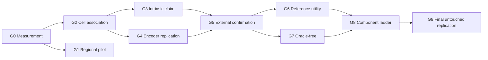

# Validation gates and authorization ladder

The machine-readable implementation is `heir.evaluation.authorization`. Gate receipts are immutable
inputs identified by SHA-256. A generic `component_pass` never grants a broader authorization.



| Gate | Required evidence | Pass authorizes |
| --- | --- | --- |
| G0 | Registration, segmentation, transcript, crop, and target-reliability QC | Running morphology experiments |
| G1 | HESCAPE + UNI2-h against all regional controls | Engineering/regional association only |
| G2 | HEST cells, oracle fine type, donor-held-out image effect | Within-study cell-context association |
| G3 | Prespecified mask/crop/context ladder | The precise nucleus, cell, or context conclusion supported by the pattern |
| G4 | Same estimand with an independent encoder | Representation-robust association |
| G5 | Non-GSE250346 registered cell-resolved cohort | External morphology–state generalization |
| G6 | Image-conditioned matched/wrong/generic bank substitution | Personalized-reference claim |
| G7 | Predicted H&E type routing and state prediction | Oracle-free H&E-only claim |
| G8 | Every retained HEIR component beats its predecessor | Claims about those retained components |
| G9 | One untouched final external replication | Full scoped HEIR validation |

Named authorizations are dependency-derived:

```text
morphology_association       = G0 and G2
nucleus_intrinsic_claim      = G0 and G2 and G3_nucleus
cell_intrinsic_claim         = G0 and G2 and (G3_nucleus or G3_cell)
external_generalization      = G0 and G2 and G5
personalized_reference_claim = G2 and G5 and G6
oracle_free_claim            = G5 and G7
full_heir_claim              = G0..G9, including the required G3 arm
```

Locked-cohort receipts move from `locked` to `opened` exactly once and record the opening commit and
timestamp. An opened cohort cannot become development evidence for the same claim.

